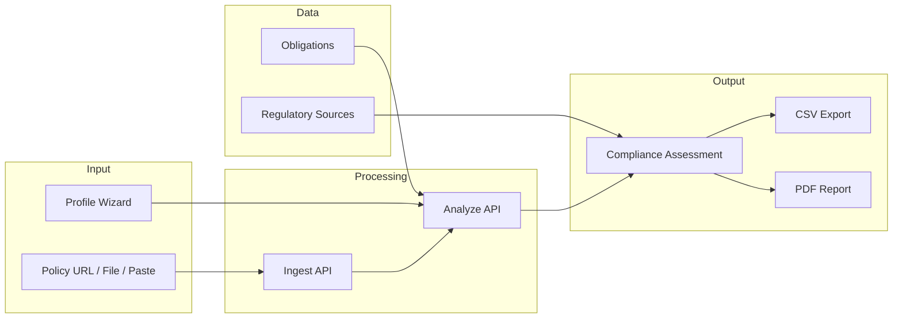
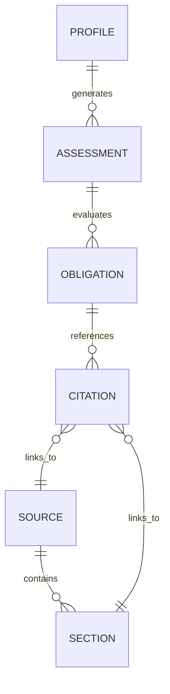

# Data Schema and Data Flow

This document describes the data structures and processing flow used by the UK AI Policy Validator.

---

## 1. Data Flow Overview



### Step-by-step

1. **Profile Wizard** — user enters org name, sector, size, AI use cases, risk level.
2. **Policy Input** — user provides policy via URL fetch, file upload (PDF/DOCX/TXT/MD), or pasted text.
3. **Ingest API** (`/api/ingest`) — normalizes input to plain text.
4. **Applicable Obligations** — filtered from the canon based on profile (use cases + risk level).
5. **Analyze API** (`/api/analyze`) — sends policy text + obligations to Anthropic Claude; returns structured assessment per obligation.
6. **Results** — displayed in UI with compliance score, status badges, findings, gaps, recommendations, and citation links.
7. **Export** — CSV compliance matrix or multi-page PDF report.

---

## 2. Data Schemas

### 2.1 Regulatory Sources (`uk_sources.json`)

Top-level:

| Field           | Type     | Description                              |
|-----------------|----------|------------------------------------------|
| `canon_version` | string   | Version identifier, e.g. "2025-01"       |
| `last_updated`  | string   | ISO date of last update                  |
| `sources`       | array    | Array of source objects                  |

Source object:

| Field             | Type     | Description                              |
|-------------------|----------|------------------------------------------|
| `source_id`       | string   | Unique ID, e.g. "ICO-AI-DP-2024"         |
| `title`           | string   | Document title                           |
| `issuing_body`    | string   | ICO / DSIT / CDEI                        |
| `jurisdiction`    | string   | "UK"                                     |
| `doc_type`        | string   | guidance / audit_report / blog           |
| `binding_strength`| string   | authoritative / recommended / informative|
| `url`             | string   | Source URL                               |
| `version`         | string   | Document version                         |
| `effective_date`  | string   | Date guidance became effective           |
| `last_checked`    | string   | Date we last verified the source         |
| `sectors`         | array    | Applicable sectors (empty = all)         |
| `sections`        | array    | Array of section objects                 |

Section object:

| Field               | Type     | Description                            |
|---------------------|----------|----------------------------------------|
| `section_id`        | string   | Unique ID, e.g. "ICO-AI-DP-2024-S2"    |
| `title`             | string   | Section title                          |
| `path`              | string   | Hierarchy path in document             |
| `summary`           | string   | Brief summary                          |
| `obligation_strength`| string  | must / should / informative            |
| `key_quotes`        | array    | Important quotes from section          |

---

### 2.2 Obligations (`uk_obligations.json`)

Top-level:

| Field           | Type     | Description                              |
|-----------------|----------|------------------------------------------|
| `canon_version` | string   | Version identifier                       |
| `last_updated`  | string   | ISO date                                 |
| `obligations`   | array    | Array of obligation objects              |

Obligation object:

| Field                | Type     | Description                              |
|----------------------|----------|------------------------------------------|
| `obligation_id`      | string   | Unique ID, e.g. "OBL-DPIA-RECRUIT-001"   |
| `title`              | string   | Short title                              |
| `description`        | string   | Full description                         |
| `requirement_type`   | string   | legal / regulatory / best_practice       |
| `obligation_strength`| string   | must / should / may                      |
| `category`           | string   | risk_assessment / transparency / etc.    |
| `applies_when`       | object   | Filters for applicability                |
| `source_citations`   | array    | Array of citation objects                |
| `related_obligations`| array    | IDs of related obligations               |
| `control_suggestions`| array    | Suggested control IDs                    |
| `maturity_levels`    | object   | baseline / enhanced / advanced text      |

`applies_when` object:

| Field        | Type     | Description                              |
|--------------|----------|------------------------------------------|
| `sectors`    | array    | Applicable sectors (empty = all)         |
| `use_cases`  | array    | e.g. ["recruitment_ai", "profiling"]     |
| `data_types` | array    | e.g. ["personal_data", "special_category"]|
| `risk_level` | array    | ["low"], ["medium"], ["high"]            |

Citation object:

| Field        | Type     | Description                              |
|--------------|----------|------------------------------------------|
| `source_id`  | string   | Links to `uk_sources.json`               |
| `section_id` | string   | Links to section within source           |
| `quote`      | string   | Direct quote                             |
| `relevance`  | string   | primary / reinforcing                    |

---

### 2.3 Assessment Result (runtime)

Returned by `/api/analyze` and used for display + export:

| Field            | Type     | Description                              |
|------------------|----------|------------------------------------------|
| `obligation_id`  | string   | From original obligation                 |
| `title`          | string   | From original obligation                 |
| `description`    | string   | From original obligation                 |
| `obligation_strength` | string | must / should / may                  |
| `category`       | string   | From original obligation                 |
| `source_citations` | array  | From original obligation                 |
| `what_good_looks_like` | array | From original obligation             |
| `status`         | string   | FULL / PARTIAL / NOT_MET                 |
| `findings`       | string   | AI-generated summary of coverage         |
| `policy_match`   | string   | Quote from policy (or null)              |
| `gaps`           | array    | List of gaps identified                  |
| `recommendation` | string   | Action to close gap                      |

---

### 2.4 Compliance Matrix CSV

Exported columns:

| Column           | Description                              |
|------------------|------------------------------------------|
| Obligation ID    | `obligation_id`                          |
| Title            | `title`                                  |
| Strength         | `obligation_strength`                    |
| Status           | FULL / PARTIAL / NOT_MET                 |
| Findings         | AI findings text                         |
| Gaps             | Semicolon-separated gaps                 |
| Recommendation   | AI recommendation                        |
| Sources          | Semicolon-separated `source_id`s         |

---

## 3. ID Naming Conventions

| Entity      | Pattern                              | Example                     |
|-------------|--------------------------------------|-----------------------------|
| Source      | `{BODY}-{TOPIC}-{YEAR}`              | ICO-AI-DP-2024              |
| Section     | `{SOURCE_ID}-S{NUMBER}`              | ICO-AI-DP-2024-S2           |
| Obligation  | `OBL-{CATEGORY}-{CONTEXT}-{NUMBER}`  | OBL-DPIA-RECRUIT-001        |
| Control     | `CTRL-{TYPE}-{SUBTYPE}`              | CTRL-DPIA-WORKFLOW          |
| Assessment  | `ASSESS-{ORG}-{YEAR}-{NUMBER}`       | ASSESS-ACME-2025-001        |

---

## 4. Evidence Chain

Every compliance finding can be traced:

```
Obligation
   ↓ (source_citations)
Regulatory Source
   ↓ (sections)
Section
   ↓ (key_quotes)
Quote
```

The Citation Panel in the UI renders this chain, showing the issuing body, document title, section, quote, binding strength, and link to the original source.

---

## 5. Relationship Diagram



---

## 6. References

- `src/data/uk_sources.json` — full regulatory source canon
- `src/data/uk_obligations.json` — full obligations register
- `docs/files/ARCHITECTURE.md` — original architecture spec
- `docs/files/4_assessment.json` — example assessment output
- `docs/files/5_compliance_matrix.csv` — example CSV export
